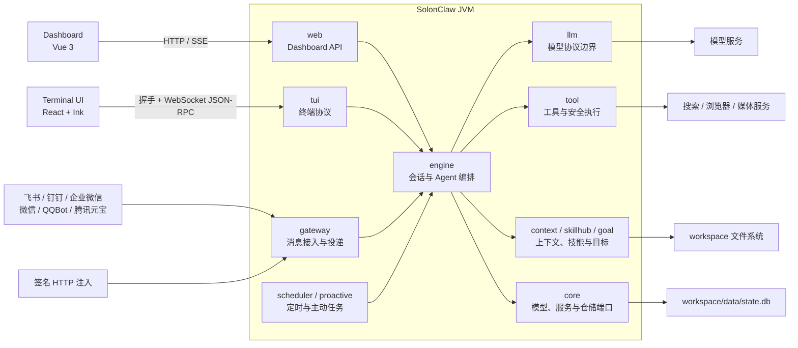

# SolonClaw 架构说明

本文面向第一次接触项目的开发者，说明当前源码的运行边界、主要模块、请求链路和扩展约束。文档描述的是当前仓库实现；当文档与源码不一致时，以源码和 [AGENTS.md](../AGENTS.md) 中的工程约束为准。

## 1. 系统定位

SolonClaw 是一个以 Java、Solon 和 Solon AI 为核心的单实例 Agent 服务。默认部署由一个 JVM 进程承载 HTTP、WebSocket、消息渠道、Agent 编排、调度和 SQLite 持久化，并提供两个客户端：

- Vue 3 Dashboard：浏览器通过同源 HTTP 和 SSE 访问后端。
- React + Ink TUI：独立 Node.js 进程通过握手接口和 WebSocket JSON-RPC 访问同一后端。

国内消息渠道和签名注入接口也是 Agent 的入口。模型、搜索、浏览器和媒体服务是外部依赖，不保存 SolonClaw 的主状态。



这不是分布式集群架构。SQLite 和工作区文件都属于本机状态，不能让多个无协调的服务实例同时共享同一个工作区。

## 2. 启动与装配

后端入口是 [`SolonClawApp`](../src/main/java/com/jimuqu/solon/claw/SolonClawApp.java)。它启动 Solon、启用 WebSocket，并在服务就绪后写入网关 PID 和运行状态。

[`bin/solonclaw`](../bin/solonclaw) 是发布包的统一命令入口：

- `solonclaw server` 启动 Java 后端。
- 其他调用默认启动 `terminal-ui/dist/entry.js`。

`bootstrap/` 只负责 Solon Bean 装配，主要入口如下：

| 装配类                                                                                                   | 职责                                      |
| -------------------------------------------------------------------------------------------------------- | ----------------------------------------- |
| [`SolonClawConfiguration`](../src/main/java/com/jimuqu/solon/claw/bootstrap/SolonClawConfiguration.java) | 应用配置、关机取证和运行内存监控          |
| [`StorageConfiguration`](../src/main/java/com/jimuqu/solon/claw/bootstrap/StorageConfiguration.java)     | SQLite 数据库、仓储端口及相关工厂         |
| [`ToolConfiguration`](../src/main/java/com/jimuqu/solon/claw/bootstrap/ToolConfiguration.java)           | 工具注册、安全审批、模型网关和核心编排器  |
| [`GatewayConfiguration`](../src/main/java/com/jimuqu/solon/claw/bootstrap/GatewayConfiguration.java)     | 渠道适配器、消息网关、命令与 Profile 路由 |
| [`DashboardConfiguration`](../src/main/java/com/jimuqu/solon/claw/bootstrap/DashboardConfiguration.java) | Dashboard 服务、认证和 HTTP 控制器依赖    |
| [`SchedulerConfiguration`](../src/main/java/com/jimuqu/solon/claw/bootstrap/SchedulerConfiguration.java) | Cron、Heartbeat、主动提醒、反思和记忆归档 |

命名 Profile 的进程内子运行时由 [`BootstrapProfileRuntimeBundleFactory`](../src/main/java/com/jimuqu/solon/claw/bootstrap/BootstrapProfileRuntimeBundleFactory.java) 创建。子容器不会扫描 HTTP Controller，也不会替换全局 `Solon.context()`。

## 3. 后端模块

### 3.1 核心分层

| 包                         | 主要职责                                               | 依赖规则                         |
| -------------------------- | ------------------------------------------------------ | -------------------------------- |
| `core/model`、`core/enums` | 会话、消息、运行、审批、渠道等领域数据                 | 不承载框架装配或 I/O             |
| `core/service`             | 编排、模型、工具、渠道、上下文等服务端口               | 由上层依赖，具体实现不放在这里   |
| `core/repository`          | 与具体持久化技术无关的仓储契约                         | 实现放在 `storage/`              |
| `engine/`                  | 会话推进、Agent 运行监督、上下文预算、压缩、委托和恢复 | 业务编排优先依赖 `core` 端口     |
| `llm/`                     | Solon AI 接入、Provider 选择、协议方言、错误分类和用量 | 对外实现 `LlmGateway`            |
| `tool/`                    | 内置工具、工具集、安全预检、审批、进程和结果存储       | 所有副作用必须经过安全与审计边界 |
| `gateway/`                 | 渠道适配、入站准入、授权、命令、Profile 路由和消息投递 | 渠道差异收敛到适配器             |
| `storage/`                 | SQLite schema、仓储实现、只读 Profile 会话访问         | 实现 `core/repository` 端口      |
| `web/`                     | Dashboard 与公开 HTTP 控制器、服务、认证和响应结构     | Controller 不直接承载核心编排    |
| `tui/`                     | TUI 握手、一次性票据、WebSocket JSON-RPC 和事件桥接    | 屏幕状态留在 Node 客户端         |
| `bootstrap/`               | Bean 创建和生命周期装配                                | 不放业务规则和 HTTP Controller   |

### 3.2 支撑领域

| 包                         | 主要职责                                 |
| -------------------------- | ---------------------------------------- |
| `agent/`                   | Agent 运行范围与策略                     |
| `command/`                 | 宿主命令描述和注册                       |
| `config/`                  | 配置加载、运行时覆盖与路径派生           |
| `context/`                 | Persona、工作区上下文、记忆、技能和反思  |
| `goal/`                    | 持久目标、裁决和执行预算                 |
| `media/`、`provider/`      | 图像、语音、浏览器、搜索等能力边界与实现 |
| `pricing/`、`usage/`       | 模型价格、用量事件和成本计算             |
| `proactive/`、`scheduler/` | 主动提醒与后台调度                       |
| `profile/`                 | Profile 生命周期、工作区隔离和运行上下文 |
| `skillhub/`                | 外部技能源、导入、校验和来源记录         |
| `support/`                 | 多模块共用的运行期辅助能力               |

前端边界分别记录在 [Dashboard 前端说明](../web/README.md) 和 [TUI 说明](../terminal-ui/README.md) 中。

## 4. 核心运行链路

### 4.1 消息渠道与 HTTP 注入

渠道适配器统一实现 [`ChannelAdapter`](../src/main/java/com/jimuqu/solon/claw/core/service/ChannelAdapter.java)，并把入站消息交给 [`InboundMessageHandler`](../src/main/java/com/jimuqu/solon/claw/core/service/InboundMessageHandler.java)。主要链路是：

```text
渠道适配器或 /api/gateway/message
  -> Profile 路由与渠道用户授权
  -> 入站去重与持久化准入
  -> 斜杠命令或 ConversationOrchestrator
  -> AgentRunSupervisor
  -> LlmGateway <-> ToolRegistry / 工具审批
  -> SessionRepository / AgentRunRepository
  -> DeliveryService -> 渠道回复
```

[`DefaultGatewayService`](../src/main/java/com/jimuqu/solon/claw/gateway/service/DefaultGatewayService.java) 负责入站准入、授权、命令分流、对话调用和回复投递。通过 Profile 路由和用户授权的原始渠道消息进入入站总账；稳定幂等键避免平台重投造成重复执行，未完成消息可按恢复水位重新消费。

真正的会话推进位于 [`DefaultConversationOrchestrator`](../src/main/java/com/jimuqu/solon/claw/engine/DefaultConversationOrchestrator.java)。它解析会话、处理忙碌策略、准备上下文和工具，并把运行交给 [`AgentRunSupervisor`](../src/main/java/com/jimuqu/solon/claw/engine/AgentRunSupervisor.java) 监督。模型调用通过 [`LlmGateway`](../src/main/java/com/jimuqu/solon/claw/core/service/LlmGateway.java) 隔离具体协议。

### 4.2 Dashboard

Dashboard 前端构建产物打包到后端静态资源中，开发环境也可以从 `web/dist/` 读取。页面请求经过 `DashboardAuthFilter`，Controller 调用对应的 `DashboardXxxService`，再进入核心端口、网关服务或仓储。

聊天链路与渠道共用 `ConversationOrchestrator`，不会在前端复制 Agent 逻辑：

```text
DashboardChatController
  -> DashboardChatService
  -> ConversationOrchestrator
  -> SSE 运行事件
```

跨 Profile 管理请求使用统一的 `profile` 作用域。跨 Profile 会话查询通过目标工作区的只读仓储完成，避免把另一个 Profile 的配置临时装入当前全局运行时。

### 4.3 TUI

[`TerminalUiController`](../src/main/java/com/jimuqu/solon/claw/tui/TerminalUiController.java) 提供握手入口，客户端先换取短时一次性票据，再连接 TUI WebSocket。WebSocket 使用 JSON-RPC 请求、响应和事件；Java 后端拥有会话、命令、工具、模型和审批逻辑，Node 客户端只管理渲染、输入和交互状态。

### 4.4 调度与主动任务

Cron、Heartbeat、主动提醒、反思、技能维护和记忆归档由 `scheduler/` 与 `proactive/` 触发。这些能力并不共用一条推理链：需要完整会话和工具执行的任务进入 `ConversationOrchestrator`；记忆归档与反思等流程先通过 `AgentRunControlService` 协调前台空闲窗口，再按各自流程调用 `LlmGateway`；主动提醒直接使用 `LlmGateway` 完成分析和消息生成。

## 5. Profile 隔离

`default` Profile 使用主工作区；命名 Profile 位于：

```text
<workspace>/profiles/<profile>/
```

每个 Profile 可以拥有独立的 `config.yml`、`.env`、Persona 文件、技能、日志和 `data/state.db`。隔离由三层共同完成：

1. [`ProfileManager`](../src/main/java/com/jimuqu/solon/claw/profile/ProfileManager.java) 管理目录、元数据、创建、克隆、导入导出和生命周期。
2. [`ProfileRuntimeScope`](../src/main/java/com/jimuqu/solon/claw/profile/ProfileRuntimeScope.java) 用线程作用域携带 Profile 名、工作区、环境快照和子容器，并为异步任务提供显式传播。
3. 网关按配置选择独立进程或进程内复用：
   - 独立模式由 [`ProfileGatewayLifecycleService`](../src/main/java/com/jimuqu/solon/claw/profile/ProfileGatewayLifecycleService.java) 管理端口、PID、日志和进程状态。
   - `solonclaw.gateway.multiplexProfiles=true` 时，[`ProfileMultiplexRuntimeManager`](../src/main/java/com/jimuqu/solon/claw/gateway/service/ProfileMultiplexRuntimeManager.java) 在 default 进程中创建命名 Profile 子运行时并路由消息。

Profile 作用域不能依赖普通 `ThreadLocal` 的隐式继承。新建线程、线程池任务或回调时，必须使用 `ProfileRuntimeScope` 的捕获和包装入口传播上下文；子进程环境也必须使用 Profile 环境快照，避免泄露其他 Profile 的凭据。

## 6. 配置与持久化

### 6.1 工作区

启动级 `solonclaw.workspace` 选择工作区根目录。默认目录结构由 [`AppConfig`](../src/main/java/com/jimuqu/solon/claw/config/AppConfig.java) 派生：

```text
workspace/
├── config.yml          # 实际运行配置
├── context/            # 上下文文件
├── skills/             # 本地技能
├── cache/              # 附件和工具结果缓存
├── logs/               # 运行日志
├── data/
│   └── state.db        # SQLite 主状态
└── profiles/           # 命名 Profile 工作区
```

`src/main/resources/app.yml` 提供应用默认值和 Solon 启动配置，`workspace/config.yml` 是用户运行配置，根目录 [`config.example.yml`](../config.example.yml) 只是参考模板。配置加载统一经过 `AppConfig`、`AppConfigLoader` 和 `RuntimeConfigResolver`；不要在业务类中自行解析 YAML 或引入第二套配置源。

### 6.2 SQLite

[`SqliteDatabase`](../src/main/java/com/jimuqu/solon/claw/storage/repository/SqliteDatabase.java) 初始化 schema、WAL、FTS 搜索表和数据库文件权限。SQLite 保存的主要状态包括：

- 会话、消息、绑定和全文搜索索引；
- Agent run、事件、工具调用、恢复和控制命令；
- Cron、用量、审批与敏感配置审计；
- 渠道授权、入站总账、媒体和状态；
- Profile 委托任务和尝试记录。

Persona、记忆 Markdown、技能、日志、缓存和工作产物继续保存在文件系统。需要原子更新的文件应复用现有锁和临时文件替换实现，不能绕过工作区路径保护。

## 7. 安全与信任边界

| 边界          | 当前保护                                                   |
| ------------- | ---------------------------------------------------------- |
| Dashboard     | 访问令牌换取短生命周期 HttpOnly 会话、同源校验、安全响应头 |
| TUI WebSocket | HTTP 握手、短时一次性票据、协议输入校验                    |
| HTTP 消息注入 | HMAC 签名、重放窗口、nonce 去重和请求体上限                |
| 消息渠道      | 平台适配器、用户授权、配对策略和入站幂等                   |
| 工具副作用    | 路径与 URL 预检、危险命令规则、Tirith 扫描、人工审批和审计 |
| 密钥配置      | 响应脱敏、受控 reveal、敏感 set/reveal 追加式审计          |
| Profile       | 独立工作区、环境快照、运行作用域和凭据冲突检测             |

新增工具或管理入口时，不得从 Controller、命令处理器或 Provider 直接执行危险副作用。应复用 `SecurityPolicyService`、`DangerousCommandApprovalService`、路径保护、审计仓储和统一错误响应。

## 8. 扩展位置

- 新模型协议：在 `llm/` 中复用 Solon AI 能力，并通过方言注册点接入；不要在 Controller 或工具中拼接模型 HTTP 请求。
- 新消息渠道：实现 `ChannelAdapter`，将平台协议、连接状态和附件处理收敛到 `gateway/platform/<name>/`，再由 `GatewayConfiguration` 装配。
- 新工具：放入 `tool/runtime/`，通过 `DefaultToolRegistryBuilder` 注册，并接入既有安全、审批和结果存储链路。
- 新 Dashboard 能力：遵循 `DashboardXxxController`、`DashboardXxxService`、`web/src/api/` 和 `web/src/views/` 的分层。
- 新仓储：先在 `core/repository` 定义端口，再在 `storage/repository` 实现并由 `StorageConfiguration` 装配。
- 新技能来源：实现 `skillhub/source/SkillSource`，复用统一下载、校验、审计和路径保护。

## 9. 架构契约与已知例外

目标依赖方向是：

```text
访问层（web / tui / gateway）
  -> 编排层（engine）
  -> 端口与模型（core）
  <- 适配实现（llm / tool / storage / gateway platform）

bootstrap 只负责把上述对象装配成运行图。
```

当前源码仍有少量已登记的跨层依赖，例如：

- `engine` 仍直接引用部分 `gateway.feedback` 和 `tool.runtime` 实现。
- `gateway/command` 仍直接引用少量 `DashboardXxxService`。
- `bootstrap` 需要跨模块 import 以完成组合根装配，但其中不得出现业务判断。

这些是现状说明，不是新代码应复制的模式。重构时应优先把稳定契约下沉到 `core/service` 或对应功能端口，并保持 Controller、装配和业务规则分离。

## 10. 变更核对清单

涉及架构边界的改动至少核对以下事项：

1. 是否复用了现有端口、配置解析、路径保护和安全审批。
2. 是否保持 Profile 工作区、环境、Bean 容器和异步上下文隔离。
3. 是否把业务逻辑留在服务或编排层，而不是 `bootstrap` 或 Controller。
4. 是否避免让 `engine`、`tool`、`gateway` 与 `web` 形成新的双向依赖。
5. 是否为 SQLite schema、跨 Profile 读取、后台任务和真实 HTTP/WebSocket 行为补充相应测试。
6. 是否同步更新 [README](../README.md)、配置示例和对应子系统文档。
