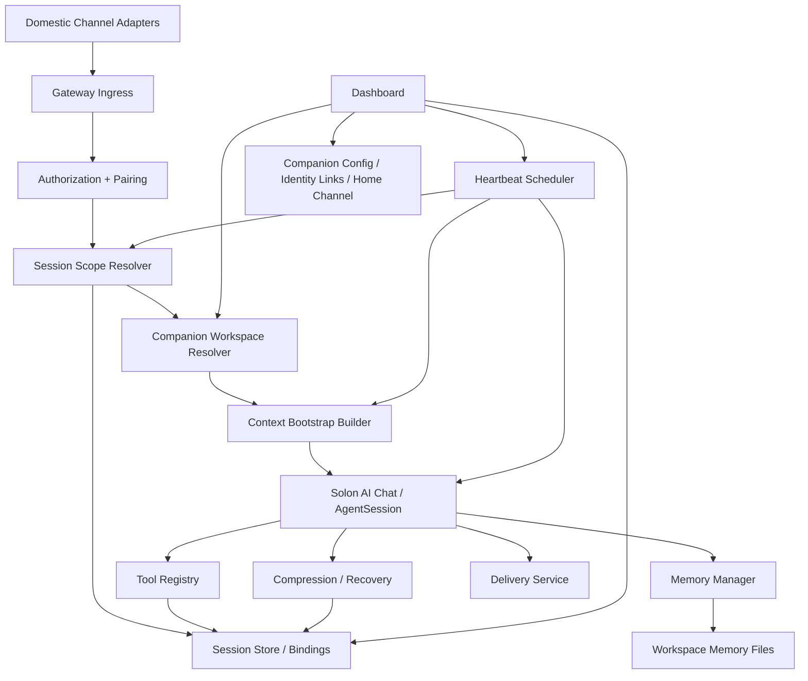

# OpenClaw 陪伴型 Agent 设计稿

## 1. 目标与对应 Hermes 能力点

本设计对应 Hermes 的以下能力面，并严格受 `AGENTS.md` 约束：

- `A. Agent 核心与会话`
  - 多轮会话与会话持久化
  - `/new`、`/retry`、`/undo`、`/branch`、`/resume`
  - checkpoint / rollback
- `C. 消息网关与渠道适配`
  - 国内渠道网关
  - 渠道鉴权与会话绑定
  - home channel / 状态同步 / 跨端连续会话
  - dashboard-first setup / doctor
- `E. 工具系统`
  - send_message
  - session_search
  - 定时任务
- `F. 技能、记忆、上下文`
  - MEMORY / USER / AGENTS 等上下文文件协同
  - 跨会话检索与总结
  - 长期记忆

本设计不追求“把 OpenClaw 全量搬进来”，而是抽取其中最关键的 companion 机制，并用更适合 Java / Solon / Solon AI 的方式落地到 `jimuqu-agent`。

一句话定义：

> 在 `jimuqu-agent` 中，agent 不应只被实现为“收到输入后调用模型给出回答”的助手，而应被实现为“长期存在于工作区、会话、渠道与记忆中的陪伴型实体”。

## 2. 已确认范围与待确认范围

### 2.1 已确认范围

- 仅保留国内渠道：`feishu`、`dingtalk`、`wecom`、`weixin`
- dashboard-first，不补完整 CLI/TUI 向导
- websocket-first，微信继续保留 long-poll
- 不做多模态输入、图像理解/生成、TTS、独立语音转写
- 不做浏览器自动化内置主线
- 不做海外渠道
- 单实例架构
- 部署形态仍为 `java -jar` 与 Docker

### 2.2 待确认范围

- 是否需要“多 companion persona 并存”，还是第一版只保留单 companion
- heartbeat 的默认投递目标规则
- 是否需要跨渠道身份链接的 dashboard 管理界面
- 是否需要在第一版中暴露 presence / idle / last-seen 到 dashboard

未确认前，第一版先按“单 companion + 单实例 + dashboard 管理”推进。

## 3. 当前仓库基线

当前仓库已经具备 companion 方案的基础承接面，但实现仍偏“会话式助手”：

- 配置与 Solon 装配：
  - `src/main/java/com/jimuqu/agent/config/AppConfig.java`
  - `src/main/java/com/jimuqu/agent/bootstrap/JimuquAgentConfiguration.java`
- 上下文与记忆：
  - `src/main/java/com/jimuqu/agent/context/FileContextService.java`
  - `src/main/java/com/jimuqu/agent/context/FileMemoryService.java`
  - `src/main/java/com/jimuqu/agent/context/DefaultMemoryManager.java`
- 会话持久化：
  - `src/main/java/com/jimuqu/agent/storage/repository/SqliteSessionRepository.java`
  - `src/main/java/com/jimuqu/agent/storage/session/SqliteAgentSession.java`
- 网关与命令：
  - `src/main/java/com/jimuqu/agent/gateway/service/DefaultGatewayService.java`
  - `src/main/java/com/jimuqu/agent/gateway/command/DefaultCommandService.java`
- 定时调度：
  - `src/main/java/com/jimuqu/agent/scheduler/DefaultCronScheduler.java`
- dashboard：
  - `src/main/java/com/jimuqu/agent/web/DashboardSessionService.java`

### 3.1 当前实现的不足

1. `FileContextService` 仍是“读取若干文件拼 prompt”的形态，缺少 companion 级 workspace 合约。
2. `FileMemoryService` 只有 `MEMORY.md / USER.md` 两层，没有 daily memory、identity、soul、heartbeat checklist。
3. `SessionRepository` 以 `source_key -> session` 绑定为主，尚未抽象出 DM / 群 / home channel / canonical identity 的连续性路由。
4. `DefaultCronScheduler` 只有 cron，没有“在主会话内定期醒来”的 heartbeat 机制。
5. `DeliveryService` 关注“发送成功”，尚未承接陪伴型 agent 需要的 ack、typing、presence、身份前缀等投递行为。
6. dashboard 具备会话、cron、config 面板，但没有 companion profile / workspace / identity-links / heartbeat 管理面。

## 4. OpenClaw Companion 机制在本项目中的定义

OpenClaw 的 companion 感不是单靠一段 prompt，而是依赖以下五层：

1. `人格工作区`
   - `AGENTS.md`、`SOUL.md`、`IDENTITY.md`、`USER.md`、`TOOLS.md`
2. `会话连续性`
   - 同一个用户、同一个 companion，在不同时间和渠道上回到同一条连续会话
3. `磁盘记忆`
   - 长期记忆与每日记忆明确分层，并进入 session compaction / recall 链路
4. `消息侧人设投递`
   - 名称、emoji、typing、ack、chunking、home channel 结果回投
5. `主动醒来`
   - heartbeat 在主会话中周期性执行，必要时主动触达

`jimuqu-agent` 第一版 companion 化，应优先完整落这五层，而不是先做更多 provider/channel 花活。

## 5. 目标架构



设计原则：

- `bootstrap/config/core` 保持稳定
- companion 是 agent 核心的一部分，不做成松散插件系统
- LLM 协议细节继续留在 `llm`
- 会话、记忆、渠道、定时任务边界清晰

## 6. 核心设计

### 6.1 Companion Workspace 合约

第一版建议把现有 `runtime/context` 从“平铺文件目录”升级为“companion 工作区根目录”。

推荐目录：

```text
runtime/
  context/
    agents/
      main/
        AGENTS.md
        SOUL.md
        IDENTITY.md
        USER.md
        TOOLS.md
        HEARTBEAT.md
        MEMORY.md
        memory/
          2026-04-22.md
```

兼容策略：

- 若 `runtime/context/agents/main/` 不存在，则回退到当前 `runtime/context/` 平铺文件读取
- 当 dashboard 首次进入 companion 设置页时，可触发 bootstrap 文件补齐

说明：

- `AGENTS.md`
  - 工作区规则与记忆使用方式
- `SOUL.md`
  - 身份、边界、风格、对外操作原则
- `IDENTITY.md`
  - 名称、emoji、avatar、vibe、creature
- `USER.md`
  - 用户偏好、称呼、时区、长期背景
- `TOOLS.md`
  - 本地环境工具习惯说明
- `HEARTBEAT.md`
  - 心跳运行的轻量 checklist
- `MEMORY.md`
  - curated long-term memory
- `memory/YYYY-MM-DD.md`
  - daily running memory

### 6.2 Companion Identity

当前 `AppConfig.AgentConfig` 只有 `personalities`，更接近“系统 prompt 模板”，而不是 companion identity。

建议新增 companion identity 模型：

- `companionId`
- `displayName`
- `emoji`
- `avatarPath`
- `creature`
- `vibe`
- `outboundPrefix`
- `ackStrategy`
- `typingStrategy`
- `humanDelay`

落地方式：

- 文件真相优先：`IDENTITY.md`
- 配置覆盖作为 dashboard 写回/默认值来源
- 运行时解析结果缓存到 `CompanionProfileService`

建议新增服务：

- `context/CompanionProfileService`
- `context/IdentityMarkdownParser`

不要把 companion identity 继续塞进 `personalities`。`personalities` 可以保留，用于“系统风格模板”；而 companion identity 表示“这个 agent 是谁”。

### 6.3 会话连续性与路由

当前绑定模型：

- `bindings(source_key -> session_id)`
- `source_key = platform:chatId:userId`

这对于简单单渠道对话足够，但不够支撑 companion。

建议新增“会话作用域解析层”：

- `SessionScopeResolver`
- `SessionBindingKey`
- `CanonicalPeerIdentity`

目标作用域：

- `main`
  - companion 与 owner 的主私聊会话
- `dm`
  - 私聊按 canonical identity 路由
- `group`
  - 群聊独立会话
- `thread`
  - 线程/子话题会话
- `heartbeat`
  - 绑定到主会话而非独立隔离

建议规则：

1. 单用户默认模式
   - 允许把 owner 在不同国内渠道上的 direct message 收束到同一 `main` 会话
2. 多人安全模式
   - 非 owner 仍按 `platform + userId` 隔离
3. 群聊
   - 永远独立，不加载私密长期记忆
4. 微信 long-poll
   - 保留现有特殊性，但 session scope 仍统一由 resolver 输出

建议新增表：

- `session_bindings_v2`
  - `binding_key`
  - `session_id`
  - `scope_type`
  - `companion_id`
  - `channel`
  - `peer_id`
  - `updated_at`
- `identity_links`
  - `canonical_id`
  - `channel`
  - `peer_id`
  - `display_name`
  - `updated_at`

过渡期：

- 继续读旧 `bindings`
- 新逻辑优先写 `session_bindings_v2`
- 若新表无记录，则回退旧绑定行为

### 6.4 记忆分层

当前 `FileMemoryService` 只有长期记忆，且依赖显式工具操作。

companion 设计建议分为三层：

1. `Long-term curated memory`
   - 文件：`MEMORY.md`
   - 内容：偏好、约定、常见纠正、稳定环境信息
2. `Daily memory`
   - 文件：`memory/YYYY-MM-DD.md`
   - 内容：当天事件、上下文、已发生但未沉淀的事项
3. `Session transcript`
   - 数据库 `sessions.ndjson`
   - 内容：完整对话轨迹、工具调用、压缩摘要

写入原则：

- 显式“记住这个” -> 立即写 daily / long-term
- compaction 临近 -> 触发 memory flush
- 群聊上下文默认不加载私密长期记忆

建议新增接口：

- `MemoryLayeredService`
- `DailyMemoryService`
- `MemoryFlushService`

建议保留：

- `MemoryService`
  - 继续作为长期记忆工具面

建议扩展：

- `DefaultMemoryManager`
  - 在 `buildSystemPrompt` 时按 `SessionScope` 决定是否注入 `MEMORY.md`
  - 在 `prefetch` 中补 daily memory / recent summaries
  - 在 `syncTurn` 中支持轻量自动写 daily memory

### 6.5 上下文组装

当前 `FileContextService.buildSystemPrompt(String sourceKey)` 过于扁平。

建议引入：

- `CompanionContextRequest`
  - `sourceKey`
  - `sessionId`
  - `scopeType`
  - `companionId`
  - `channel`
  - `isHeartbeat`
  - `isSharedContext`

建议 `ContextService` 逐步演进为：

```java
String buildSystemPrompt(String sourceKey);
String buildSystemPrompt(CompanionContextRequest request);
```

新组装顺序：

1. 项目根 `AGENTS.md`
2. companion workspace `AGENTS.md`
3. `SOUL.md`
4. `IDENTITY.md`
5. `USER.md`
6. `TOOLS.md`
7. `MEMORY.md`（仅私密主会话）
8. `memory/today + yesterday`
9. runtime prompt
10. skills index

这样，context 不再只是“全局规则 + 长期记忆”，而是真正代表 companion 的完整状态。

### 6.6 消息侧 companion 行为

第一版不追求把每个 OpenClaw UI 细节完全做齐，但 companion 需要的投递侧行为应最小闭环：

- 名称/emoji 前缀
- typing / progress 策略
- human-like delay
- home channel 回投
- heartbeat 消息静默策略

建议新增抽象：

- `gateway/delivery/CompanionDeliveryProfile`
- `gateway/delivery/DeliveryPresenceService`

渠道适配只需要消费统一输出：

- `displayName`
- `emoji`
- `typingMode`
- `ackMode`
- `responsePrefix`
- `humanDelayMsRange`

这层不应写进 `llm`，也不应分散进每个 adapter 的 if/else 中。

### 6.7 Heartbeat

这是 companion 与普通助手的分界点之一。

当前已有：

- `DefaultCronScheduler`
- `cron_jobs`

但 cron 是“精确调度”，不是“主会话中的周期醒来”。

建议新增 heartbeat 机制：

- 仍由 `scheduler` 统一调度
- 但 heartbeat 不创建隔离会话，而是回到主会话执行
- 读取 `HEARTBEAT.md`
- 输出支持静默 token，例如 `HEARTBEAT_OK`

建议新增服务：

- `scheduler/HeartbeatScheduler`
- `scheduler/HeartbeatRunner`
- `context/HeartbeatPromptService`

建议新增配置：

```yaml
jimuqu.agent.heartbeat.intervalMinutes: 0
```

推荐行为：

- 默认关闭
- dashboard 开启
- 默认投递到 home channel
- 无重要输出时静默，不污染会话

### 6.8 Dashboard-first companion 管理

当前 dashboard 已有 session / cron / config / env / doctor。

建议新增 companion 管理面，而不是增加 CLI wizard：

- `DashboardCompanionController`
- `DashboardCompanionService`

第一版接口：

- `GET /api/dashboard/companion/profile`
- `POST /api/dashboard/companion/profile`
- `POST /api/dashboard/companion/bootstrap`
- `GET /api/dashboard/companion/workspace`
- `POST /api/dashboard/companion/heartbeat`
- `GET /api/dashboard/companion/identity-links`
- `POST /api/dashboard/companion/identity-links`

功能：

- 查看/编辑 `IDENTITY.md`、`SOUL.md`、`USER.md`
- 一键补齐 bootstrap 文件
- 配置 home channel
- 配置 heartbeat
- 管理跨渠道身份链接

## 7. 数据模型与配置扩展建议

### 7.1 `AppConfig` 扩展

建议新增：

- `AgentWorkspaceConfig`
  - `defaultCompanionId`
  - `workspaceRoot`
  - `bootstrapEnabled`
- `AgentSessionConfig`
  - `dmScope`
  - `crossChannelOwnerMain`
  - `sharedContextProtection`
- `HeartbeatConfig`
  - `enabled`
  - `intervalMinutes`
  - `activeHours`
  - `deliveryTarget`
  - `okSilence`
- `CompanionConfig`
  - `identity`
  - `delivery`
  - `presence`

配置命名建议继续走 `jimuqu.agent.*`，避免散到顶层。

### 7.2 数据库表建议

在现有 SQLite 上新增以下表即可，不需要引入新数据库：

- `companions`
  - `companion_id`
  - `display_name`
  - `emoji`
  - `avatar_path`
  - `workspace_dir`
  - `updated_at`
- `session_bindings_v2`
  - `binding_key`
  - `session_id`
  - `scope_type`
  - `companion_id`
  - `updated_at`
- `identity_links`
  - `canonical_id`
  - `channel`
  - `peer_id`
  - `display_name`
  - `updated_at`
- `presence_state`
  - `channel`
  - `scope_key`
  - `last_seen_at`
  - `last_input_at`
  - `home_channel`
  - `updated_at`

注意：

- 这不是多租户设计，只是单实例 companion 内部状态
- 保持 `SqliteDatabase.initSchema()` 的渐进式 `alter table` 风格即可

## 8. 对现有类的改造建议

### 8.1 `FileContextService`

从“读取固定文件”升级为“按 companion workspace + session scope 组装上下文”。

建议：

- 保留类名
- 新增 `buildSystemPrompt(CompanionContextRequest request)`
- 将当前 `buildSystemPrompt(String sourceKey)` 变为兼容入口

### 8.2 `FileMemoryService`

从“长期记忆工具实现”收敛为：

- 长期记忆文件读写
- daily memory 读写拆给新服务

### 8.3 `SqliteSessionRepository`

新增：

- `resolveByScope(SessionBindingKey key)`
- `bindScope(SessionBindingKey key, String sessionId)`

旧 `sourceKey` API 继续保留，逐步适配。

### 8.4 `DefaultGatewayService`

在 `handle(message)` 前增加：

- `SessionScopeResolver`
- `CompanionProfileResolver`
- `PresenceRecorder`

并让 `conversationOrchestrator` 获取更完整的上下文请求，而不只是 `sourceKey`。

### 8.5 `DefaultConversationOrchestrator`

建议演进点：

- 从 `sourceKey` 驱动，升级为 `CompanionContextRequest + SessionRecord`
- `runScheduled` 拆分出 `runHeartbeat`
- memory flush / heartbeat silent token / 共享上下文保护放在这里做主链控制

### 8.6 `DefaultCronScheduler`

保留 cron，不改语义。

新增并行心跳链路：

- cron: 精确时点任务
- heartbeat: companion 周期性 awareness

### 8.7 `DashboardSessionService`

继续负责会话可视化，但 companion 化后应增加：

- session scope
- companion id
- canonical peer identity
- home channel / last active channel

## 9. 推荐实施顺序

### Phase 1: Workspace 与 Identity

目标：

- 补齐 companion workspace 文件合约
- dashboard 可查看/编辑 `IDENTITY.md`、`SOUL.md`、`USER.md`
- 兼容旧 `runtime/context` 平铺模式

涉及：

- `AppConfig`
- `FileContextService`
- `DashboardCompanionService`
- `SqliteDatabase` 新增 `companions`

### Phase 2: Session Scope 与跨渠道连续性

目标：

- 引入 `SessionScopeResolver`
- owner 跨渠道 direct message 合并到主会话
- 群聊与共享上下文隔离

涉及：

- `DefaultGatewayService`
- `SqliteSessionRepository`
- `SourceKeySupport`
- `DashboardSessionService`

### Phase 3: 分层记忆与 compaction flush

目标：

- `MEMORY.md + daily memory`
- 主会话与共享上下文加载策略分离
- 接近压缩阈值时自动记忆沉淀

涉及：

- `DefaultMemoryManager`
- `FileMemoryService`
- `DefaultContextCompressionService`

### Phase 4: Heartbeat

目标：

- 主会话内 heartbeat
- `HEARTBEAT.md`
- home channel 告警/静默策略

涉及：

- `DefaultCronScheduler`
- 新增 `HeartbeatScheduler`
- `DeliveryService`
- dashboard 开关配置

### Phase 5: Companion Delivery Polish

目标：

- typing / ack / prefix / delay
- presence / home channel / last-seen

涉及：

- `DeliveryService`
- 各 `ChannelAdapter`
- dashboard 状态面板

## 10. 第一版明确不做

为避免偏离主线，以下继续不进入 companion 第一版：

- 海外渠道
- 多 companion 多实例隔离
- 语音模式
- 多模态输入
- 图像理解与图像生成
- 浏览器自动化内置实现
- 插件系统
- 独立 OpenAI 兼容 API server
- 复杂 presence 网络拓扑

## 11. 关键结论

### 11.1 OpenClaw 对 agent 的定义在本项目中的等价物

在 `jimuqu-agent` 中，companion 不应定义为“一个更有人设的 prompt”，而应定义为：

- 一个有工作区的 agent
- 一个有磁盘记忆的 agent
- 一个跨渠道保持连续性的 agent
- 一个会主动醒来的 agent
- 一个通过 dashboard 管理的 agent

### 11.2 对当前实现最关键的改造点

如果只能优先做三件事，顺序应该是：

1. workspace 合约化
2. session scope / identity link
3. heartbeat

这三项做好后，`jimuqu-agent` 才会从“国内渠道上的会话助手”变成“具有陪伴感的 companion agent”。
